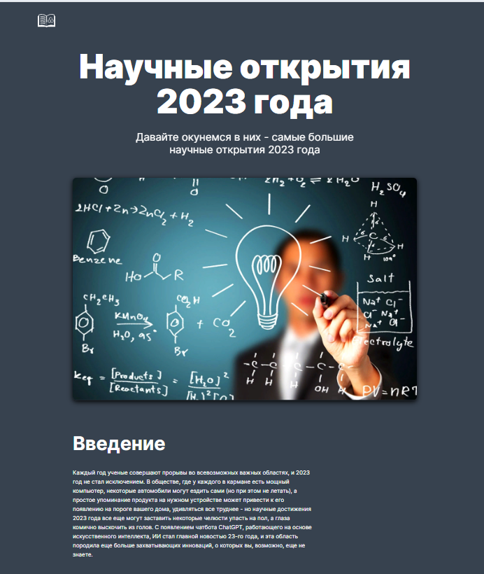

### science

#### О проекте

Адаптивная верстка по макету из Figma. В проекте используются семантические теги, css-переменные, изображения оптимизированы, шрифты подключены локально.
Применена техника pixel perfect.

#### Технологии

  
 
 
 
  

#### Установка и запуск приложения

<b>Развернуть</b>

Клонировать репозиторий:

    git clone https://github.com/Mariyazakharova73/science.git

Запустить через live server

[Ссылка на проект](https://mariyazakharova73.github.io/science/)

  

